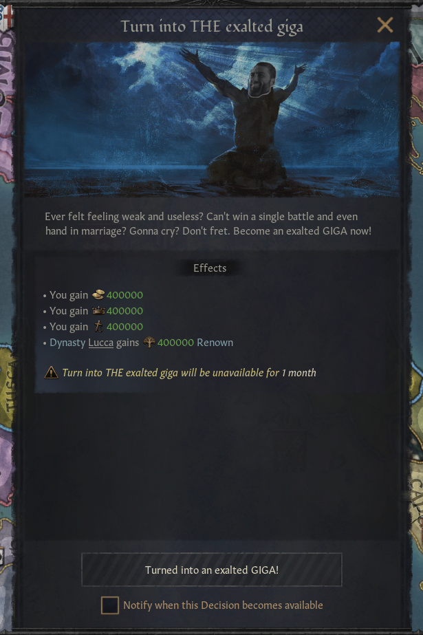

<h1 align="center"><strong>Exalted Giga Crusader Kings III</strong></h1>
<p align="center">
  
</p>
<p align="center">
    Become a giga ruler by cheating your way through CK3 :sunglasses:
</p>

# What does this mod do?
This is a simple mod that adds the following to the player's ruler:
<center>

| Item | Amount | Icon |
| :--: | :--: | :--: |
| Gold | `400,000` |  |
| Piety | `400,000` |  |
| Prestige | `400,000` |  |
| Renown | `400,000` |  |

</center>

# About Mod
This mod was tested on the 1.9.2.1 version of the game, but it should be compatible with any mods and should also be able to withstand future updates. However, I left it compatible up to 1.9.x version of CK3 just in case. I created this mod when I wanted to cruise my way through CK3 and dominate the world. It's pretty fun and way more convenient than having to type in the debug console per command. 

There is a 30 days cooldown in-between the usage. If you want to change it, visit the section *[Changing modifier into custom values](#changing-modifier-into-custom-values)*.

# Installation
1. Move the `exalted_giga` folder and `exalted_giga.mod` file into your Crusader Kings 3 mods foler, usually located in `C:\Users\<your_name>\Documents\Paradox Interactive\Crusader Kings III\mod`

2. Load the mod into your playset via Paradox Launcher (when launching the game from Steam)

# Usage in-game
The cheat is accessible via the decision menu.
<p align="center">
    
</p>
<p align="center">
    
</p>


# Changing modifier into custom values
To change the value from `400,000` to any custom values, edit the file `exalted_giga\common\decisions\my_decisions.txt` using any text editor (Notepad, Notepad++, VSCode, etc). Change the following numbers into any custom values.

```txt
effect = {
	add_gold = 400000 # Change this value for gold modifier
	add_prestige = 400000 # Change this value for prestige modifier
	add_piety = 400000 # Change this value for piety modifier
	dynasty = { 
		add_dynasty_prestige = 400000 # Change this value for renown modifier
	}
}
```

You might want to do this if balancing is an issue. Furthermore, you can also change the cooldown duration (even disable it completely) by changing the following line in the same file:
```text
cooldown = { days = 30 }
```
If you want to disable cooldown, change it into:
```text
cooldown = { days = 0 }
```
Or you can also use months as counter:
```text
cooldown = { months = 6 }
```
Or year:
```text
cooldown = { year = 2 }
```