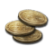
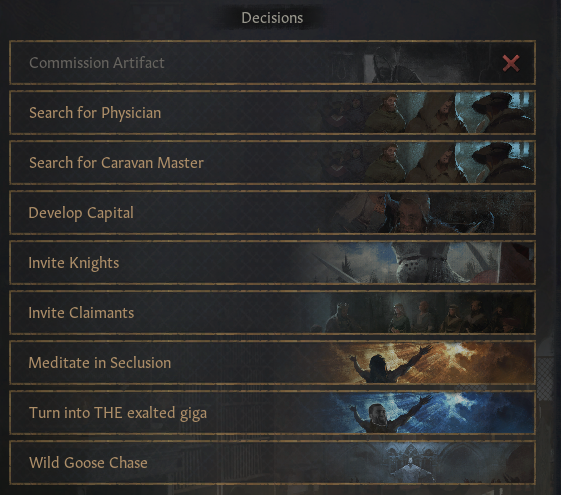

<h1 align="center"><strong>Exalted Giga Crusader Kings III</strong></h1>
<p align="center">
  
</p>
<p align="center">
    Become a giga ruler by cheating your way through CK3 :sunglasses:
</p>

# What does this mod do?

This is a simple mod that adds the following to the player's ruler:

<center>

|   Item   |   Amount    |                        Icon                         |
| :------: | :---------: | :-------------------------------------------------: |
|   Gold   | `1,000,000` |      |
|  Piety   | `1,000,000` |     |
| Prestige | `1,000,000` |  |
|  Renown  | `1,000,000` |    |

</center>

# About Mod

This mod was tested on the 1.10.\* version of the game, but it should be compatible with any mods and should also be able to withstand future updates. I created this mod when I wanted to cruise my way through CK3 and dominate the world. It's pretty fun and way more convenient than having to type in the debug console per command.

There are two methods to use the mod:

1. A mod menu disguised as an event triggered by a decision
2. An all-in-one decision to add all stats

There is a 30 days cooldown in-between the usage of the second method. If you want to change it, visit the section _[Changing modifier into custom values](#changing-modifier-into-custom-values)_.

# Installation

1. Move the `exalted_giga` folder and `exalted_giga.mod` file into your Crusader Kings 3 mods folder, usually located in `C:\Users\<your_name>\Documents\Paradox Interactive\Crusader Kings III\mod`

2. Load the mod into your playset via Paradox Launcher (when launching the game from Steam)

# Usage in-game

## First Method (Mod Menu)

Mod menu is accessible by clicking the decision `Exalted Giga Menu` as seen below.

<p align="center">
    
</p>

And the mod menu will be opened

<p align="center">
    
</p>

From here, you can choose one of the modifiers to add the value into your existing stats. This is the effect after adding 1M gold and 1M prestige.

<p align="center">
    
</p>

## Second Method (One Click for All Decision)

The cheat is accessible via the decision menu as well by choosing `Turn into THE exalted giga` decision. The difference is that this method features a single button that adds 1M to each stats.

<p align="center">
    
</p>
<p align="center">
    
</p>

# Changing modifier into custom values

To change the value from `1,000,000` to any custom values, edit the file `exalted_giga\common\decisions\exgiga_decisions.txt` using any text editor (Notepad, Notepad++, VSCode, etc). Change the following numbers into any custom values.

```txt
effect = {
	add_gold = 1000000 # Change this value for gold modifier
	add_prestige = 1000000 # Change this value for prestige modifier
	add_piety = 1000000 # Change this value for piety modifier
	dynasty = {
		add_dynasty_prestige = 1000000 # Change this value for renown modifier
	}
}
```

And the file `exalted_giga\events\exgiga_events.txt\` as well

```txt
    option = {
        name = "Gain 1M gold"
        add_gold = 1000000 # Change this value for gold modifier
    }
    option = {
        name = "Gain 1M piety"
        add_piety = 1000000 # Change this value for piety modifier
    }
    option = {
        name = "Gain 1M prestige"
        add_prestige = 1000000 # Change this value for prestige modifier
    }
    option = {
        name = "Gain 1M renown"
        dynasty = {
            add_dynasty_prestige = 1000000 # Change this value for renown modifier
        }
    }
```

You might want to do this if balancing is an issue. Furthermore, you can also change the cooldown duration (even disable it completely) by changing the following line in the same file:

```text
cooldown = { days = 30 }
```

If you want to disable cooldown, change it into:

```text
cooldown = { days = 0 }
```

Or you can also use months as counter:

```text
cooldown = { months = 6 }
```

Or year:

```text
cooldown = { year = 2 }
```
